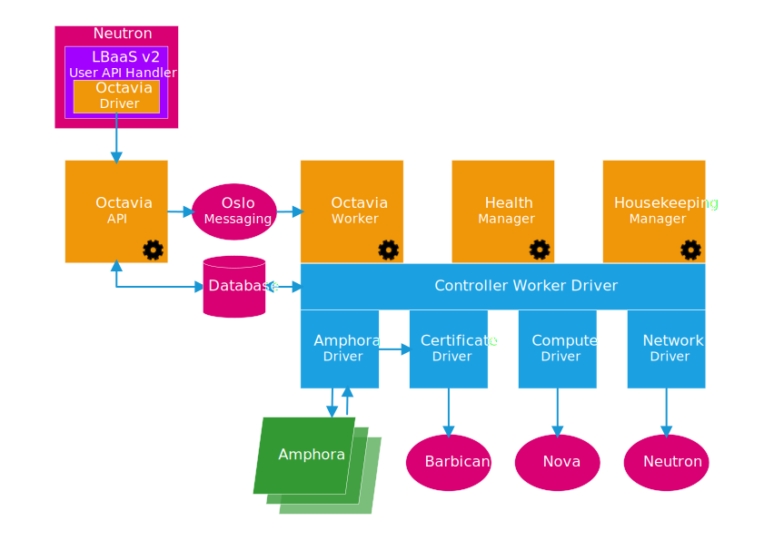
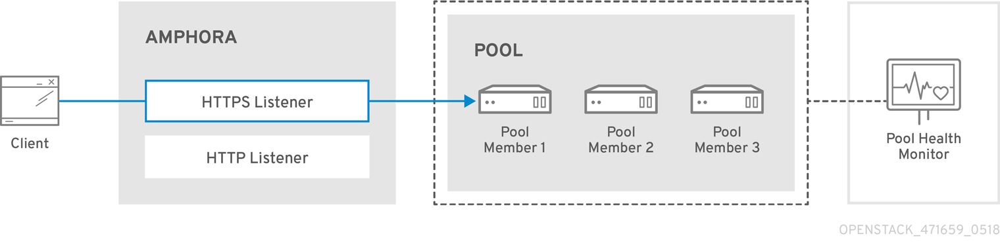

# 1. Giới thiệu về Octavia

____

# Mục lục

- [1.1 Octaiva là gì?](#about)
- [1.2 Các thành phần của Octavia](#components)
- [1.3 Các khái niệm sử dụng trong Octavia](#concepts)
- [1.4 Cách thức hoạt động của Octavia](#how-work)
- [Các nội dung khác](#content-others)

____

# <a name="content">Nội dung</a>

- ### <a name="about">1.1 Octaiva là gì?</a>
    - Octavia là một phần mềm mã nguồn mở cho phép tạo và quản lý các `Load Balancer` trong môi trường Openstack.
    - Việc cung cấp load balancing được thực hiện trên các `amphora` và được quản lý qua các sub-command `openstack loadbalancer`
    - Octavia cung cấp các thuật toán load balancing dựa trên HAProxy và hỗ trợ một số thuật toán như:
        - leastconn
        - roundrobin
        - source
        - sticky-session
    - Việc truy cập tới load balancer được hỗ trợ các protocol sau:
        - http/https
        - tls-connection
        - tcp
    

- ### <a name="components">1.2 Các thành phần của Octavia</a>
    

    - Octavia bao gồm các thành phần sau:
        - octavia-api: Cung cấp API, chấp nhận các request liên quan đến việc tạo và quản lý với Load Balancer. Các tác vụ sẽ được gửi tới các thành phần khác thông qua message queue.
        - octavia-housekeeping: Clean records trong database mà đã xóa(DELETED) và quản lý spares pool, quản lý amphora certificate rotation.
        - octavia-worker: Thực hiện các tác vụ được nhận từ request API mà octavia-api gửi tới.
        - octavia-health-manager: Thực hiện monitor amphora, đảm bảo amphora chạy và hoạt động đúng. Ngoài ra sẽ giải quyết các vấn đề liên quan đến fail-over khi amphora bị lỗi.
        - amphora: là một máy ảo (virtual machine - instance) hoặc là một container hay bare metal servers thực hiện cung cấp cân bằng tải cho môi trường ứng dụng trong một project. Hiện tại, một amphora đang là một máy ảo chạy HAProxy sử dụng hệ điều hành Ubuntu.

- ### <a name="concepts">1.3 Các khái niệm sử dụng trong Octavia</a>
    - Amphora: một máy ảo, hay container, dedicated hardware,.. thực hiện nhiệm vụ cho load balancing trong hệ thống Octavia. Chấp nhận các request từ clien tới front-end config và chia tải tới các back-end đã được cấu hình. Amphora yêu cầu liên lạc với controller thông qua một đường mạng riêng biệt (LB management) và chạy trên compute node.. thực hiện gửi heartbeat tới health-manager.
    - Spare Amphora: Chỉ vai trò của amphora đối với hệ thống Octavia, khi là một spare amphora, thì nó sẽ trờ thành dự bị để thay thế cho các amphora đang hoạt động bị lỗi, đảm bảo cho hoạt động sao cho ổn định nhất.
    - VIP (Virtual IP Address): Một địa chỉ IP liên kết với Load Balancer. Được sử dụng để cung cấp cho Client truy cập đến Load Balancer từ internet.
    - TLS termination - Transport Layer Security Termination: Một kiểu protocol của Load Balancer mà HTTPS sesstion bị terminate (being decrypted) ngay trên amphora.
    - Listener: Endpoint lắng nghe các request từ clien gởi đến. Một listener có thể có nhiều pool, tương ứng với front-end block trong cấu hình HAProxy.
    - Pool: Một group member xử lý các request từ client gửi đến thông qua VIP, tương ứng với một back-end block cấu hình trong HAProxy.
    - Member: Là compute instances phục vụ cho việc cung cấp các traffic phía sau các amphora pool. Có thể hiểu theo cách khác, thì đây được hiểu là các backend member trong HAProxy cung cấp các dịch vụ.
    - L7 Policy (Layer 7 Policy): Là một tập hợp L7 rules có thể nhận các giá trị logic (True hoặc False) cho một chính sách routing bất kỳ đối với các request của các giao thức như HTTP hay Terminated HTTPS mà khớp vớ rule chứa trong L7 Policy. (rule trả về giá trị True). Tại đây, ta có thể khai báo các hành động để thực hiện xử lý các request chẳng hạn như điều hướng đến một đường dẫn nào đó. Ví dụ: khi người dùng truy cập sử dụng protocol là `http://example.com`, ta có thể tận dụng L7 rule để redirect đến `https://example.com`
    - L7 Rule (Layer 7 rule): là một quy tắc nằm trong L7 Policy, cho phép match với các request được gửi đến VIP thông qua các biểu thức logic và `regular expression`. 
  
    

- ### <a name="how-work">1.4 Cách thức hoạt động của Octavia</a>

    - Octavia sử dụng một đường mạng riêng để thực hiện quản lý và monitor các amphora được tạo ra. Đường mạng này không nhất thiết là phải cần có thể đi ra internet mà nó chỉ cần từ các node cài octavia-* có thể thực hiện liên lạc đến các amphora là đủ. Do vậy, mô hình mạng của Octavia có thể được triển khai như sau: 
  
    

    - Khi các service của octavia khởi chạy, octavia-health-manager sẽ thực hiện listen các heartbeat trên port 5555 (mặc định) mà các amphora nếu có gửi đến. Các amphora's api listen port 9443 (mặc định) để thực hiện các tác vụ.
    - Hiện tại, Octavia đang hỗ trợ việc liên lạc từ controller node đến các amphora thông qua một đường truyền mã hóa sử dụng certificates. 
____

# <a name="content-others">Các nội dung khác</a>
