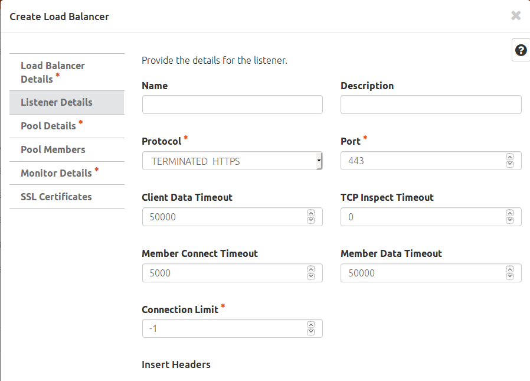
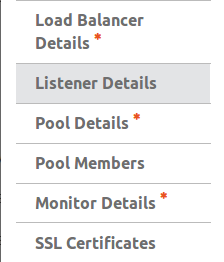
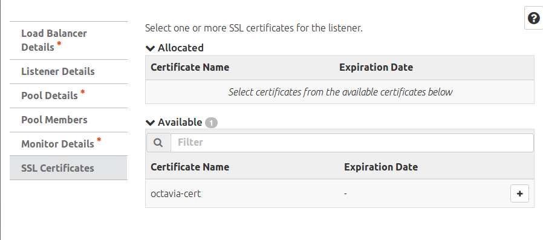

# 6. Terminate HTTPS trong Octavia

____

# Mục lục

- [6.1 Yêu cầu](#requirements)
- [6.2 Cấu hình](#config)
- [6.3 Kiểm tra](#check)
- [Các nội dung khác](#content-others)

____
# <a name="content">Nội dung</a>

- ### <a name="requirements">6.1 Yêu cầu</a>
  - Hệ thống Openstack đã được cài đặt.
  - Octavia đã được cài đặt.
  - Barbican đã được cài đặt.
  
- ### <a name="config">6.2 Cấu hình</a>
  - Ta cần cấu hình cho cctavia sử dụng barbican để lưu trữ certificates:

        [certificates]
        cert_manager = barbican_cert_manager

- ### <a name="check">6.3 Kiểm tra</a>
    - Giả sử, ta đang có 2 file:

        - server_ca.cert.pem
        - server_ca.key.pem
        - 2 file này có passphrase là `Welcome123`
    -  User cần tạo secret cho các file này. Ví dụ như sau:

            openstack secret store --name octavia-cert --payload-content-type='text/plain' --payload="$(cat server_ca.cert.pem)"

            openstack secret store --name octavia-key --payload-content-type='text/plain' --payload="$(cat server_ca.key.pem)"

            openstack secret store --name octavia-passphrase --payload-content-type='text/plain' --payload 'Welcome123' --secret-type passphrase
    
    - Octavia sẽ sử dụng nội dung của các secret trên để cấu hình tls. Vì vậy, ta cần phải cấp quyền cho phép user octavia (giả sử có id là: ) đọc được nội dung của các secret trên:

            openstacl acl user add --user user_id href_link

        trong đó: `href_link` là href của secret cần cấp quyền cho octavia và `user_id` là ID của user octavia .

    - Tiếp theo, ta tạo container chứa các secret trên với câu lệnh:

            openstack secret container create --name tls-octavia --type certificate --secret certificate="$(openstack secret list | awk '/ octavia-cert / {print $2}')" --secret private_key="$(openstack secret list | awk '/ octavia-key / {print $2}')" --secret private_key_passphrase="$(openstack secret list | awk '/ octavia-passphrase / {print $2}')"
    
    - Bản openstack hiện tại đã có thể dự thêm quyền truy cấp (acl) của container secret cho uer octavia. Vì vậy, ta không cần phải thực hiện bước này nữa.  Để tạo ra một load balancer sử dụng tls-connection , ta thực hiện như sau: 
        - Đối với giao diện dòng lệnh:
            
                openstack loadbalancer create --name name_of_lb --vip-subnet-id subnet-id

             chờ cho trạng thái của load balancer là active và online, ta thực hiện sử dụng câu lệnh sau:

                openstack loadbalancer listener create --protocol-port 443 --protocol TERMINATED_HTTPS --name name_of_listener --default-tls-container=$(openstack secret container list | awk '/ tls-octavia / {print $2}') name_of_lb

        - Đối với giao diện web-interface:
            tại giao diện tạo listener, ta chọn protocol cho load balancer là TERMINATED_HTTPS:

            

            sau khi chọn protocol là TERMINATED_HTTPS, một menu là `SSL Certificates` sẽ được hiện ra:

            

            cho phép ta chọn lựa các certificates sẽ được sử dụng cho việc tạo tls-connection load balancer:

            
       
____

# <a name="content-others">Các nội dung khác</a>
